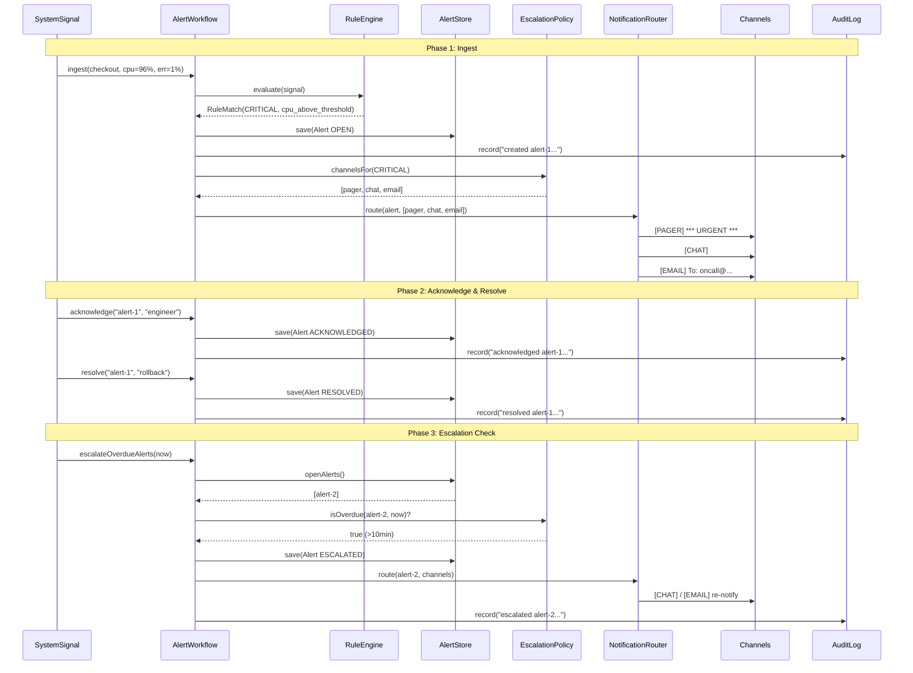

# Complexity Management Alert System

This project is a small architecture study about alerting systems and complexity management.

Alerting looks simple at first: receive an event, decide whether it matters, notify someone. In real systems, it quickly becomes complex because product, operations, compliance, and customer-specific needs all change independently.

This project explores how to keep that complexity manageable by separating:

- Detection rules: what counts as a problem
- Escalation policy: who should know and when
- Workflow state: open, acknowledged, escalated, resolved
- Delivery channels: email, chat, SMS, pager, webhook
- Audit trail: why a decision was made

## Architecture

```mermaid
flowchart TB
    subgraph input [Input]
        SystemSignal["SystemSignal\n(service, cpu%, errorRate)"]
    end

    subgraph rules [Rule Engine]
        AlertRule["<<interface>>\nAlertRule"]
        CpuPressureRule["CpuPressureRule\n(threshold=90)"]
        ErrorRateRule["ErrorRateRule\n(threshold=0.05)"]
        RuleEngine["RuleEngine"]
        RuleMatch["RuleMatch\n(severity, reason)"]

        CpuPressureRule -.->|implements| AlertRule
        ErrorRateRule -.->|implements| AlertRule
        RuleEngine -->|"contains List<>"| AlertRule
        RuleEngine -->|returns| RuleMatch
    end

    subgraph workflow [Workflow Orchestrator]
        AlertWorkflow["AlertWorkflow\n.ingest()\n.acknowledge()\n.resolve()\n.escalateOverdueAlerts()"]
    end

    subgraph state [Alert State]
        Alert["Alert\n(id, service, severity,\nstatus, openedAt, reason)"]
        Severity["<<enum>> Severity\nLOW | HIGH | CRITICAL"]
        AlertStatus["<<enum>> AlertStatus\nOPEN | ACKNOWLEDGED\nESCALATED | RESOLVED"]
        AlertStore["<<interface>>\nAlertStore"]
        InMemoryAlertStore["InMemoryAlertStore"]

        Alert --> Severity
        Alert --> AlertStatus
        InMemoryAlertStore -.->|implements| AlertStore
    end

    subgraph policy [Escalation Policy]
        EscalationPolicy["EscalationPolicy\n.channelsFor(severity)\n.isOverdue(alert, now)"]
    end

    subgraph delivery [Notification Delivery]
        NotificationRouter["NotificationRouter\n.route(alert, channelNames)"]
        NotificationChannel["<<interface>>\nNotificationChannel"]
        ConsolePagerChannel["ConsolePagerChannel\n[PAGER] *** URGENT ***"]
        ConsoleChatChannel["ConsoleChatChannel\n[CHAT] #alerts"]
        ConsoleEmailChannel["ConsoleEmailChannel\n[EMAIL] To: oncall@..."]
        RecordingChannel["RecordingChannel\n(test only)"]

        NotificationRouter -->|"contains List<>"| NotificationChannel
        ConsolePagerChannel -.->|implements| NotificationChannel
        ConsoleChatChannel -.->|implements| NotificationChannel
        ConsoleEmailChannel -.->|implements| NotificationChannel
        RecordingChannel -.->|implements| NotificationChannel
    end

    subgraph audit [Audit Trail]
        AuditLog["<<interface>>\nAuditLog"]
        InMemoryAuditLog["InMemoryAuditLog"]
        InMemoryAuditLog -.->|implements| AuditLog
    end

    SystemSignal -->|"ingest()"| AlertWorkflow
    AlertWorkflow -->|evaluates| RuleEngine
    RuleEngine -->|reads| SystemSignal
    AlertWorkflow -->|creates & transitions| Alert
    AlertWorkflow -->|persists| AlertStore
    AlertWorkflow -->|"channelsFor(severity)"| EscalationPolicy
    AlertWorkflow -->|"route(alert, channels)"| NotificationRouter
    AlertWorkflow -->|records| AuditLog
```



## Alert Lifecycle



## Why This Architecture Has Value

The architecture treats business complexity as a first-class design concern instead of hiding it inside one large service method.

- Rule changes do not require rewriting workflow state handling.
- New notification channels can be added behind the router.
- Escalation behavior can evolve as policy instead of becoming scattered `if` statements.
- Audit records make decisions explainable after the incident.
- Tests describe the contract between rules, policies, state transitions, and delivery behavior.

## How It Handles Requirement Changes

Requirement changes usually arrive in different shapes. This design gives each shape a place to land.

| Change | Where It Belongs | Why It Stays Contained |
| --- | --- | --- |
| Add a new severity rule | Rule Engine | Detection logic is isolated from notification and persistence |
| Add Slack or PagerDuty | Notification Router | Channels are adapters, not core workflow logic |
| Escalate unresolved critical alerts after 10 minutes | Escalation Policy | Timing and responsibility rules live in policy |
| Require auditability for compliance | Audit Log | Decisions are recorded as part of workflow execution |
| Support tenant-specific behavior | Rule and policy definitions | Configuration varies while the execution model remains stable |

The goal is not to eliminate complexity. The goal is to make complexity explicit, named, tested, and movable.

## Code

- [`src/main/java/dev/jinli/complexity/`](src/main/java/dev/jinli/complexity/) — core types, rules, workflow, and console channel implementations
- [`src/test/java/dev/jinli/complexity/AlertSystemTest.java`](src/test/java/dev/jinli/complexity/AlertSystemTest.java) — tests covering rule evaluation, state transitions, and escalation

## Run

```bash
mvn test
```

Run the interactive demo to see simulated notifications on the console:

```bash
mvn compile && java -cp target/classes dev.jinli.complexity.AlertDemo
```

